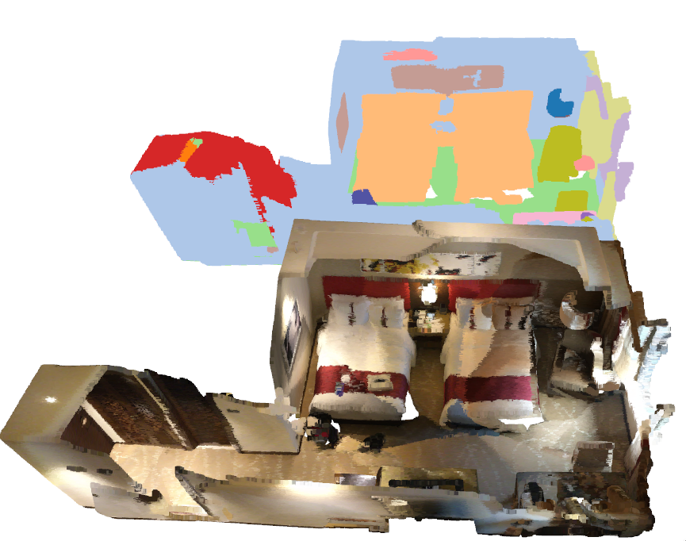
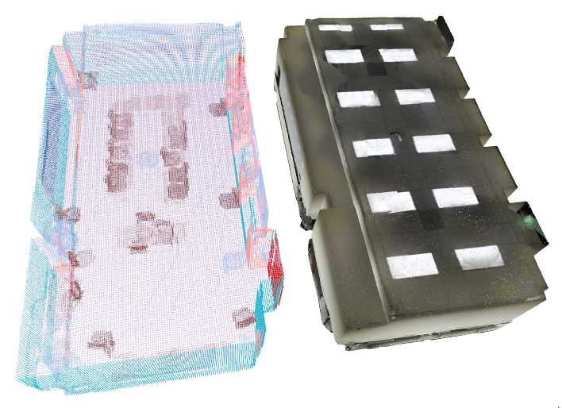

[pypi-url]: https://pypi.org/project/MinkowskiEngine/


# Spatio-Temporal Segmentation

This repository contains the accompanying code for [4D-SpatioTemporal ConvNets: Minkowski Convolutional Neural Networks, CVPR'19](https://arxiv.org/abs/1904.08755).


## Requirements

- Ubuntu 14.04 or higher
- CUDA 10.1 or higher
- pytorch 1.3 or higher
- python 3.6 or higher
- GCC 6 or higher


## Installation

You need to install `pytorch` and [`Minkowski Engine`][pypi-url] either with `pip` or with anaconda.

### Pip

The MinkowskiEngine is distributed via [PyPI MinkowskiEngine][pypi-url] which can be installed simply with `pip`.
First, install pytorch following the [instruction](https://pytorch.org). Next, install `openblas`.

```
sudo apt install openblas

pip3 install torch torchvision

pip3 install -U MinkowskiEngine
```

Next, clone the repository and install the rest of the requirements

```
git clone https://github.com/chrischoy/SpatioTemporalSegmentation/

cd SpatioTemporalSegmentation

pip install -r requirements.txt
```

### Troubleshooting

Please visit the MinkowskiEngine [issue pages](https://github.com/StanfordVL/MinkowskiEngine/) if you have difficulties installing Minkowski Engine.


## ScanNet Training

1. Download the ScanNet dataset from [the official website](http://kaldir.vc.in.tum.de/scannet_benchmark/documentation). You need to sign the terms of use.

2. Next, preprocess all scannet raw point cloud with the following command after you set the path correctly.

```
python -m lib.datasets.preprocessing.scannet
```

3. Train the network with

```
export BATCH_SIZE=N;
./scripts/train_scannet.sh 0 \
	-default \
	"--scannet_path /path/to/preprocessed/scannet"
```

Modify the `BATCH_SIZE` accordingly.

The first argument is the GPU id and the second argument is the path postfix
and the last argument is the miscellaneous arguments.


### mIoU vs. Overall Accuracy

The official evaluation metric for ScanNet is mIoU.
OA, Overal Accuracy is not the official metric since it is not discriminative. This is the convention from the 2D semantic segmentation as the pixelwise overall accuracy does not capture the fidelity of the semantic segmentation.
On 3D ScanNet semantic segmentation, OA: 89.087 -> mIOU 71.496 mAP 76.127 mAcc 79.660 on the ScanNet validation set v2.

Then why is the overall accuracy least discriminative metric?  This is due to the fact that most of the scenes consist of large structures
such as walls, floors, or background and scores on these will dominate the statistics if you use Overall Accuracy.


## Synthia 4D Experiment

1. Download the dataset from [download](http://cvgl.stanford.edu/data2/Synthia4D.tar)

2. Extract

```
cd /path/to/extract/synthia4d
wget http://cvgl.stanford.edu/data2/Synthia4D.tar
tar -xf Synthia4D.tar
tar -xvjf *.tar.bz2
```

3. Training

```
export BATCH_SIZE=N; \
./scripts/train_synthia4d.sh 0 \
	"-default" \
	"--synthia_path /path/to/extract/synthia4d"
```

The above script trains a network. You have to change the arguments accordingly. The first argument to the script is the GPU id. Second argument is the log directory postfix; change to mark your experimental setup. The final argument is a series of the miscellaneous aruments. You have to specify the synthia directory here. Also, you have to wrap all arguments with " ".


## Stanford 3D Dataset

1. Download the stanford 3d dataset from [the website](http://buildingparser.stanford.edu/dataset.html)

2. Preprocess

Modify the input and output directory accordingly in

`lib/datasets/preprocessing/stanford.py`

And run

```
python -m lib.datasets.preprocessing.stanford
```

3. Train

```
./scripts/train_stanford.sh 0 \
	"-default" \
	"--stanford3d_path /PATH/TO/PREPROCESSED/STANFORD"
```

## Model Zoo

| Model         | Dataset             | Voxel Size | Conv1 Kernel Size | Performance              | Link   |
|:-------------:|:-------------------:|:----------:|:-----------------:|:-------------------------------------------------------------------------------:|:------:|
| Mink16UNet34C | ScanNet train + val | 2cm        | 3                 | Test set 73.6% mIoU, no sliding window                                          | [download](https://node1.chrischoy.org/data/publications/minknet/Mink16UNet34C_ScanNet.pth) |
| Mink16UNet34C | ScanNet train       | 2cm        | 5                 | Val 72.219% mIoU, no rotation average, no sliding window [per class performance](https://github.com/chrischoy/SpatioTemporalSegmentation/issues/13) | [download](https://node1.chrischoy.org/data/publications/minknet/MinkUNet34C-train-conv1-5.pth) |
| Mink16UNet18  | Stanford Area5 train | 5cm       | 5                 | Area 5 test 65.828% mIoU, no rotation average, no sliding window [per class performance](https://pastebin.com/Gj3PrPFr) | [download](https://node1.chrischoy.org/data/publications/minknet/Mink16UNet18-stanford-conv1-5.pth) |
| Mink16UNet34  | Stanford Area5 train | 5cm       | 5                 | Area 5 test 66.348% mIoU, no rotation average, no sliding window [per class performance](https://pastebin.com/WzhfGMQG) | [download](https://node1.chrischoy.org/data/publications/minknet/Mink16UNet34-stanford-conv1-5.pth) |

Note that sliding window style evaluation (cropping and stitching results) used in many related works effectively works as an ensemble (rotation averaging) which boosts the performance.


## Demo

The demo code will download weights and an example scene first and then visualize prediction results.

| Dataset  | Scannet                  | Stanford                  |
|:--------:|:------------------------:|:-------------------------:|
| Command  | `python -m demo.scannet` | `python -m demo.stanford` |
| Result   |     |     |


## Citing this work

If you use the Minkowski Engine, please cite:

- [4D Spatio-Temporal ConvNets: Minkowski Convolutional Neural Networks, CVPR'19](https://arxiv.org/abs/1904.08755), [[pdf]](https://arxiv.org/pdf/1904.08755.pdf)

```
@inproceedings{choy20194d,
  title={4D Spatio-Temporal ConvNets: Minkowski Convolutional Neural Networks},
  author={Choy, Christopher and Gwak, JunYoung and Savarese, Silvio},
  booktitle={Proceedings of the IEEE Conference on Computer Vision and Pattern Recognition},
  pages={3075--3084},
  year={2019}
}
```
